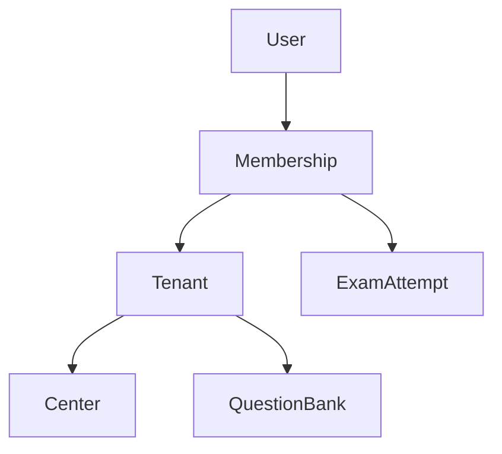

# Arquitectura Técnica - ABDQuiz

## 1. Modelo de Datos (Multitenant)

### Jerarquía
Un usuario se registra globalmente, pero sus permisos y roles están vinculados a cada Tenant (Academia/Centro) mediante una Membresía.

## 2. Orquestador de Estilos
El sistema de temas no es estático. Se basa en una inyección dinámica de tokens CSS.

1. **Middleware:** Detecta `host` y asigna `tenantId`.
2. **Provider:** Recupera `theme_config` de MongoDB.
3. **Inyección:** Inyecta variables en el `:root` de la página.
   - `--primary`: Color de marca.
   - `--secondary`: Color secundario.
   - `--logo-url`: URL del activo del tenant.

## 3. Estrategia de i18n
Para evitar el "Monolithic JSON problem", dividimos las traducciones:

- `messages/[locale]/common.json`: Navegación, botones genéricos.
- `messages/[locale]/quiz.json`: Todo lo relacionado con el examen.
- `messages/[locale]/auth.json`: Login, registro, perfiles.
- `messages/[locale]/admin.json`: Gestión de academia.

## 4. Auditoría de Código (Fire Rules)
El script `scripts/arch-guard.mjs` verifica en cada commit:
- **Límite de líneas:** > 150 líneas es error crítico.
- **Estilos:** Uso de colores hardcodeados o estilos inline es advertencia/error.

## 5. Parametrización de Exámenes
Desacopla la lógica y temporización de los exámenes de las variables duras del código.
Consiste en:
- **`ExamConfig`:** Mapeo Mongoose de plantillas técnicas.
- **`QuizService`:** Ingestionador de generación por distribución estratificada y evaluación de reglas avanzadas (`weighted`, `penalty`).
- **Navegación No Lineal:** Mapa interactivo con guardado persistente background-save en transiciones.
- **Documentación Completa:** Para más detalles técnicos, consulte [EXAM_PARAMETRIZATION.md](file:///d:/desarrollos/ABDQuiz/docs/EXAM_PARAMETRIZATION.md).
