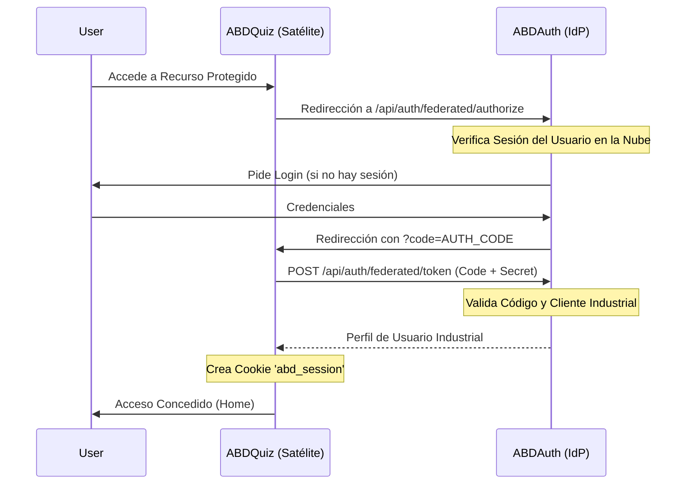

# ABD Federated Identity Handshake (v1.0)

Este documento detalla el protocolo de autenticación federada utilizado para sincronizar la identidad entre **ABDAuth** (Proveedor de Identidad - IdP) y sus satélites (ej. **ABDQuiz**).

## 1. Flujo de Autenticación



## 2. Endpoints del IdP (ABDAuth)

### `GET /api/auth/federated/authorize`
Inicia el proceso de identificación.
- **Query Params**:
  - `client_id`: ID del cliente (ej. `abdquiz-industrial-client-id`).
  - `redirect_uri`: URL de retorno del satélite.
  - `state`: (Opcional) Path al que volver tras el login.

### `POST /api/auth/federated/token`
Intercambia el código por la identidad final.
- **Body (JSON)**:
  - `code`: El código recibido en el callback.
  - `client_id`: ID del cliente.
  - `client_secret`: Clave secreta industrial.
  - `redirect_uri`: Debe coincidir con la de la fase de authorize.
- **Respuesta**:
  ```json
  {
    "access_token": "at_...",
    "user": {
      "id": "698...",
      "email": "user@abd.com",
      "role": "SUPER_ADMIN",
      "tenantId": "abd_global",
      "dbPrefix": "abd",
      "isolationStrategy": "COLLECTION_PREFIX"
    }
  }
  ```

## 3. Endpoints del Satélite (ABDQuiz)

### `GET /api/auth/federated/callback`
Recibe el código y orquesta el canje.
- Almacena el perfil en la cookie `abd_session` (httpOnly, Secure).

### `GET /api/auth/logout`
Limpia la sesión local.
- Elimina la cookie `abd_session`.
- Redirige a la Home o al IdP para un logout global.

## 4. Estándares de Seguridad
- **Time-to-Live (TTL)**: Los códigos de autorización caducan en 5 minutos.
- **Single Use**: Cada código se invalida inmediatamente después de su primer uso (prevención de ataques de repetición).
- **Atomic Validation**: El IdP valida atómicamente el `client_id`, `client_secret` y el `userId` antes de emitir la identidad.

---
**SYS_CERTIFIED - Industrial Identity Standard - Era 11**
